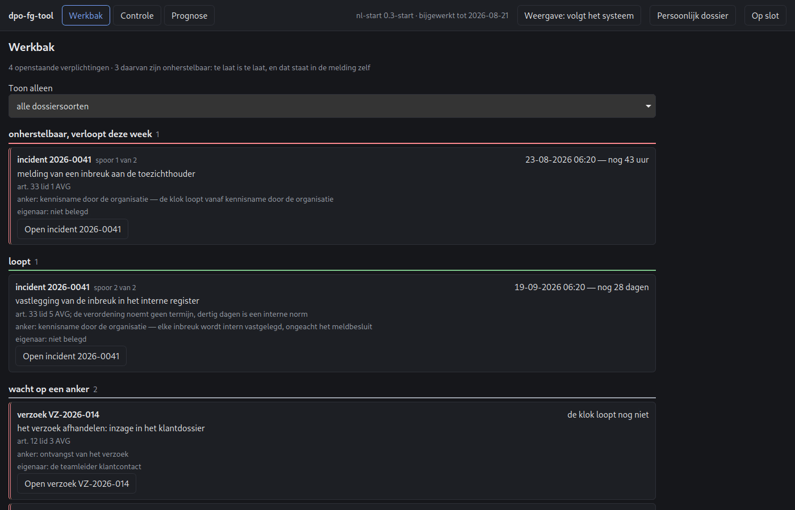
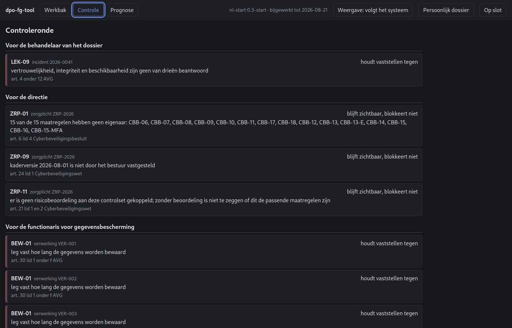
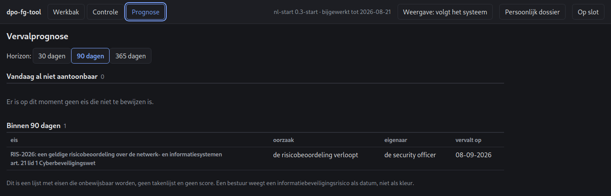
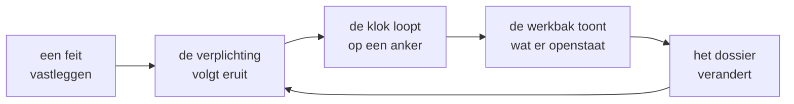
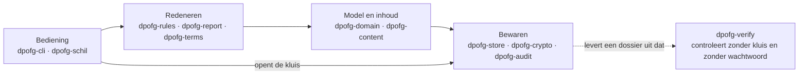

<div align="center">

# dpo-fg-tool

**Het werkdossier van de functionaris voor gegevensbescherming — lokaal, versleuteld en aantoonbaar.**

AVG, UAVG, Woo, Wpg en de Cyberbeveiligingswet in één dossier, op de eigen machine.

[](docs/PLATFORMONDERSTEUNING.md)
[](https://www.rust-lang.org)
[](#uitgangspunten)
[](STAND.md)
[](LICENSE)

</div>



---

## Inhoud

- [Waarom lokaal](#waarom-lokaal)
- [Wat de tool doet](#wat-de-tool-doet)
- [Uitgangspunten](#uitgangspunten)
- [Aan de slag](#aan-de-slag)
- [De drie schermen](#de-drie-schermen)
- [Hoe het in elkaar zit](#hoe-het-in-elkaar-zit)
- [Stand van zaken](#stand-van-zaken)
- [Documentatie](#documentatie)
- [Voorbehoud bij de juridische inhoud](#voorbehoud-bij-de-juridische-inhoud)
- [Beveiliging](#beveiliging)
- [Licentie](#licentie)

---

## Waarom lokaal

Het verwerkingsregister, de effectbeoordelingen, de datalekdossiers en de kwetsbaarhedenlijst vormen samen een volledige plattegrond van de zwakke plekken van een organisatie. In de praktijk staat dat materiaal in spreadsheets, gedeelde mappen of een cloudsuite van een derde partij.

`dpo-fg-tool` draait daarom op de eigen machine of de eigen server. Geen verplichte cloud, geen telemetrie, geen account. De gegevens staan versleuteld op de schijf van de organisatie, en het programma opent uit zichzelf nooit een netwerkverbinding. Dat wordt op Linux in de bouwstraat met `strace` nagerekend en niet alleen beloofd; voor macOS en Windows moet een gelijkwaardige controle nog worden gebouwd.

Daarboven staat één eis: **de gebruiker moet de fout niet kunnen maken.** Waar een fout onmogelijk te maken is, wordt hij onmogelijk gemaakt. Waarschuwen is de laatste maatregel, niet de eerste.

## Wat de tool doet

Het werkproces van de functionaris en de security officer, met de termijnen erbij:

| Regime | Wat er wordt bewaakt |
|---|---|
| **AVG art. 30** | Verwerkingsregister, voor verwerkingsverantwoordelijke én verwerker, met de verplichtingen die uit de antwoorden volgen |
| **AVG art. 33–34** | Datalekdossier met drie klokken op eigen ankers — melding, mededeling en interne vastlegging — en een meldbesluit in drie lagen |
| **AVG art. 35–36** | Effectbeoordeling met de voortoets, de vier inhoudseisen en de raadplegingsklok |
| **AVG art. 15–22** | Betrokkenenverzoeken met de maandtermijn, beide lezingen van het aanvangsmoment, en de kennisgeving van art. 19 |
| **AVG art. 28** | Leveranciersregister met de acht onderdelen van lid 3, elk met een vindplaats |
| **AVG hoofdstuk V** | Doorgiften buiten de EER met doorgiftebeoordeling en de telling van art. 49 |
| **Woo** | Eigen beslistermijn van vier weken, weigeringsgronden gescheiden in absoluut en relatief, zienswijze van derden |
| **Wpg** | Toepasselijkheid met motivering, jaarlijkse controle, vierjaarlijkse audit, verbeterplan per maatregel |
| **Cyberbeveiligingswet** | Zorgplichtcontrolset van art. 21 lid 3, risicobeoordeling, meldketen met de wettelijke trappen |

Daarnaast, dwars door de regimes heen: een **werkbak** met alles wat openstaat, een **controleronde** over de samenhang, een **vervalprognose** op 30, 90 en 365 dagen, en **ondertekende dossiers** die een toezichthouder controleert zonder deze software.

## Uitgangspunten

| Principe | Betekenis |
|---|---|
| **Lokaal tenzij** | Geen enkele functie vereist een internetverbinding. Optionele online bronnen zijn per stuk uit te zetten en staan standaard uit. |
| **Versleuteld in rust** | De volledige opslag is versleuteld; de sleutel wordt afgeleid uit een wachtwoordzin. Elke envelop is gebonden aan veld, record en compartiment. |
| **Aantoonbaar** | Elke wijziging landt in een hashketen die tot in de database append-only is, met ondertekende ankers tegen afkappen aan het einde. |
| **Foutbestendig** | Verplichtingen volgen uit de gegeven antwoorden; de regel hoeft niet bekend te zijn. Onvolledigheid is een teller, geen foutmelding. |
| **Klein aanvalsoppervlak** | Weinig afhankelijkheden, geheugenveilige taal, strikte contentbeveiliging, geen automatische updates zonder handtekeningcontrole. |
| **Geen leveranciersafhankelijkheid** | Alles is exporteerbaar in open, gedocumenteerde formaten. De gegevens zijn en blijven van de organisatie. |
| **Nederlands eerst** | Terminologie en sjablonen volgen de Nederlandse praktijk en de richtsnoeren van de Autoriteit Persoonsgegevens. |

## Aan de slag

### Installeren

Er is één beheerscript per platform dat bouwt, plaatst, bijwerkt, de stand toont en verwijdert. De kluis staat buiten de programmamap en blijft bij het verwijderen staan; wissen gebeurt alleen wanneer u dat apart bevestigt door het woord `WISSEN` over te typen.

```sh
./installatie/dpofg-beheer.sh              # menu
./installatie/dpofg-beheer.sh stand        # wat staat waar
./installatie/dpofg-beheer.sh installeren
```

```powershell
.\installatie\dpofg-beheer.ps1
.\installatie\dpofg-beheer.ps1 stand
```

Nodig om te bouwen: Rust 1.82 of nieuwer, Node.js met pnpm, en op Linux `libwebkit2gtk-4.1-dev`. Het script noemt wat er ontbreekt voordat het begint.

### De eerste stappen

Alles begint bij een kluis. De wachtwoordzin wordt twee keer gevraagd en er is **geen herstelmogelijkheid**: raakt de zin kwijt, dan is het dossier weg.

```sh
dpofg kluis nieuw
```

Daarna is er het grafische venster (`dpofg-schil`, of het menu-item) of de opdrachtregel. Beide werken op dezelfde kluis en tonen hetzelfde beeld — de controleronde draait in allebei dezelfde regels.

Een registerregel opbouwen, waarbij de tool bij elke stap zegt wat er nog ontbreekt:

```sh
dpofg register nieuw VER-001 "Klantenadministratie" --eigenaar "de teamleider"
dpofg register vul VER-001 --veld doeleinden --waarde "afhandelen van bestellingen"
dpofg register vul VER-001 --veld betrokkenen --waarde "klanten"
dpofg register vul VER-001 --veld gegevens --waarde "naam; adres; e-mailadres"

dpofg register toon VER-001            # 3 van de 8 onderdelen ingevuld
dpofg register vaststellen VER-001     # geweigerd zolang er iets ontbreekt
```

Een incident registreren; de klokken gaan lopen op hun eigen ankers:

```sh
dpofg incident nieuw 2026-0041 "laptop kwijtgeraakt" --signaal 2026-08-19T06:00:00Z
dpofg incident kennisname 2026-0041 2026-08-19T08:00:00Z
dpofg werkbak                          # de 72-uursklok staat er nu bij
```

De samenhang nalopen, en een dossier samenstellen dat de ontvanger zelf kan controleren:

```sh
dpofg controle                         # de regels over de hele verzameling
dpofg controle --dekking               # welke regels draaien er werkelijk
dpofg logboek anker                    # de keten verankeren
dpofg dossier ./uitlevering --aanleiding "controle 2026" --bestemd-voor "de toezichthouder"

# De ontvanger controleert het met de losse binary — zonder kluis, zonder wachtwoord
dpofg-verify dossier ./uitlevering/manifest.json
```

Het wachtwoord wordt nooit als argument aangenomen. Het wordt gevraagd, of gelezen uit `DPOFG_WACHTWOORD` voor geautomatiseerd gebruik.

## De drie schermen

Het venster kent drie schermen, elk met een eigen belofte over wat het níet zegt.

### Werkbak — wat er openstaat

*(de afbeelding bovenaan deze pagina)*

Eén lijst over alle regimes heen, gesorteerd op onherstelbaarheid en niet op datum. Elke regel draagt de grondslag en het anker waarop de klok berust. Een verplichting verdwijnt doordat het dossier verandert, nooit door een vinkje. Onderaan staat wat er níet in de lijst staat, en waar het dan wel staat.

### Controleronde — wat er niet klopt



De regels die over de samenhang gaan, gegroepeerd per ontvangerrol, want zo wordt het werk verdeeld. Geen totaal en geen score: het aantal bevindingen zegt niets over hoe ernstig de situatie is. Wat er niet kon worden beoordeeld, staat bovenaan — vóór de lijst, niet erna.

### Vervalprognose — wat er omvalt



Welke eisen op 30, 90 of 365 dagen niet meer aantoonbaar zijn, met oorzaak, eigenaar en datum. Een lijst met datums, geen takenlijst en geen cijfer. De prognose meldt uitdrukkelijk wat zij niet overziet.

Het persoonlijke dossier van de functionaris — adviezen met comply-or-explain, en onafhankelijkheidsincidenten — staat in een **tweede kluisbestand met een eigen wachtwoordzin**, in een eigen venster. De organisatie kan het niet openen; wat er in de kluis van de organisatie staat, is een hash waarmee het bestaan is aan te tonen zonder de inhoud prijs te geven.

## Hoe het in elkaar zit

Het idee onder alles: een feit wordt vastgelegd, de verplichting volgt eruit, en zij verdwijnt pas wanneer het dossier verandert.



De code is verdeeld in elf crates, van bediening naar bewaring:



| Crate | Verantwoordelijkheid |
|---|---|
| `dpofg-crypto` | sleutelafleiding, envelopversleuteling, sleutelhiërarchie, blinde index |
| `dpofg-audit` | ketenlogboek, ankers, verificatie |
| `dpofg-terms` | getypeerde termijnen, kalenderrekenkunde, opschorting, maandeindeklem |
| `dpofg-domain` | domeinmodel: registers, incidenten, volledigheid, afgeleide verplichtingen |
| `dpofg-store` | versleutelde opslag, inhoudsgeadresseerde bijlagen, versiegeschiedenis in de kluis |
| `dpofg-content` | kennispakketten met de juridische inhoud, ondertekend en met voorbehoud |
| `dpofg-rules` | controleregels, controleronde en waarschuwingsbudget |
| `dpofg-report` | werkbak, vervalprognose, dossiers samenstellen en ondertekenen |
| `dpofg-cli` | de opdrachtregel |
| `dpofg-schil` | het grafische venster: Svelte 5 in de webview van Tauri v2 |
| `dpofg-verify` | losse verificatiebinary; leest uitsluitend, vraagt geen wachtwoord |

## Stand van zaken

De kern staat en is bruikbaar, via de opdrachtregel én het venster. De opdrachtregel is bewust eerst gebouwd: dat dwingt af dat de logica in de lagen eronder zit en niet in een scherm.

Wat er werkt, wat er niet werkt en waar de grenzen liggen staat in **[`STAND.md`](STAND.md)** — inclusief de bevindingen die het nalopen heeft opgeleverd, want die laten zien waar het misging.

Twee dingen zijn hier de moeite van het vermelden waard, omdat ze bepalen hoe dit overzicht gelezen hoort te worden:

- **De regelcatalogus is groter dan wat er draait.** Niet elke regel in de catalogus heeft een evaluatiefunctie; een regel komt er pas bij wanneer de gegevens waarop hij oordeelt ook in te vullen zijn. Bewaking certificeren die op producteigen gegevens nooit kan aanslaan, is erger dan een lege plek. Vraag de werkelijke dekking op met `dpofg controle --dekking`; het aantal regels zegt niets, die opdracht wel.
- **De installatiesleutel kent geen rotatie en geen intrekking.** Ankers en dossiermanifesten dragen één vaste sleutel per kluisbestand. Raakt die kwijt, dan is de enige weg een nieuwe publiceren en de oude ernaast blijven vermelden.

## Documentatie

| Document | Inhoud |
|---|---|
| [`STAND.md`](STAND.md) | Wat er werkt, wat er niet werkt, waar de draad ligt en welke grenzen benoemd horen te worden |
| [`docs/PLAN.md`](docs/PLAN.md) | Afbakening, wettelijk kader, modules, architectuur, datamodel, compliance-mapping en risico's |
| [`docs/FOUTBESTENDIGHEID.md`](docs/FOUTBESTENDIGHEID.md) | De ontwerpladder, foutbestendiging per werkproces, interactiepatronen en de controleregels |
| [`docs/SCHIL.md`](docs/SCHIL.md) | Het ontwerp van het grafische venster en wat het bewust niet doet |
| [`docs/FORMAAT.md`](docs/FORMAAT.md) | De bestandsformaten, zodat een toezichthouder een dossier kan controleren zonder software van de aanleverende organisatie |
| [`docs/PLATFORMONDERSTEUNING.md`](docs/PLATFORMONDERSTEUNING.md) | Linux, macOS en Windows: sleutelopslag, hardwaretokens, ondertekening, distributie en de testmatrix |
| [`docs/REVIEW.md`](docs/REVIEW.md) | De juridische en beveiligingstoetsing waarop het plan berust |

## Voorbehoud bij de juridische inhoud

Het meegeleverde kennispakket is een **vertrekpunt, geen bron van recht**. De termijnen, feestdagen en grondslagen zijn niet door een jurist vastgesteld en niet gecontroleerd tegen de geconsolideerde wettekst. Verifieer elk onderdeel tegen de bron voordat u erop vertrouwt; `dpofg pakket voorbehoud` toont wat er te controleren valt.

De consolidatiedatum van het pakket reist mee in elke export en elk dossier, zodat zichtbaar blijft op welke stand van het recht een berekening berust.

## Beveiliging

Kwetsbaarheden meldt u volgens de procedure in [`SECURITY.md`](SECURITY.md). Meld ze niet via een openbare issue.

## Licentie

Alle rechten voorbehouden. Zie [`LICENSE`](LICENSE). Auteursrecht © 2026 WimLee115.

Ontwikkeld en onderhouden door **WimLee115**.
